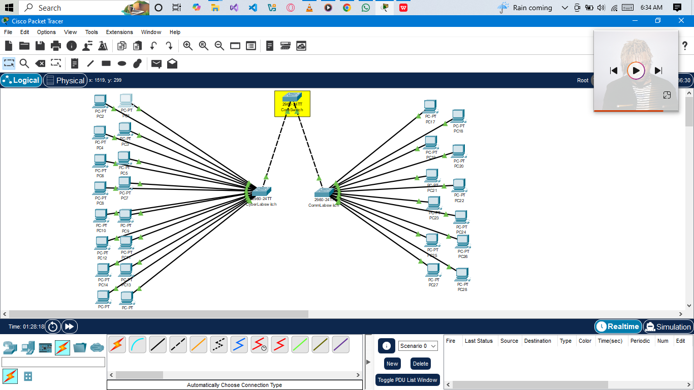

# Networking Essentials Assignment

This project demonstrates a simple **network topology** built using Cisco Packet Tracer.

---

## 📌 Network Setup
- **CyberLab**: 16 PCs + 1 Switch  
- **CommLab**: 12 PCs + 1 Switch  
- **Core Switch**: Connects both labs  

**Total devices:** 28 PCs, 3 switches  

---

## 🖼️ Network Topology

---

## 🔧 Configuration
- IP Address Range: `192.168.1.1` → `192.168.1.28`  
- Subnet Mask: `255.255.255.0`  
- All devices are in the same network (single subnet).  

---

## 📂 File Info
- Packet Tracer file: `Networking_Basics/my_topology.pkt`  
- Screenshot: `topology.png`  

---

## ✅ How to Run
1. Open the `.pkt` file in **Cisco Packet Tracer**.  
2. Check connectivity by pinging across PCs.  
3. Explore switch connections for CyberLab and CommLab.  

---

## 📖 Author
- *Khalil_atreides*  
- University: *[KNUST]*  
- Course: *CyberSecurity Internship*  

